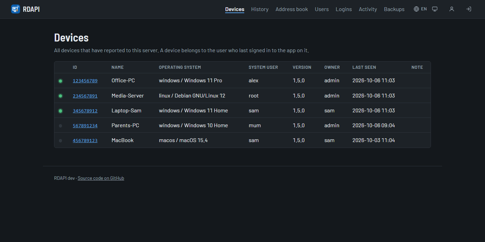
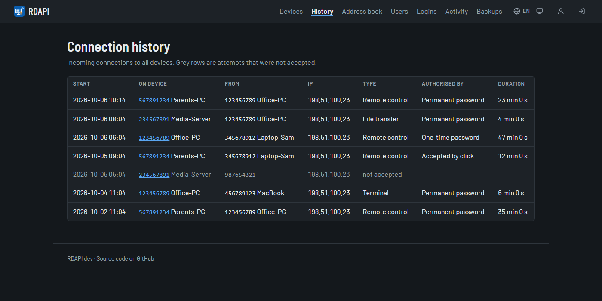
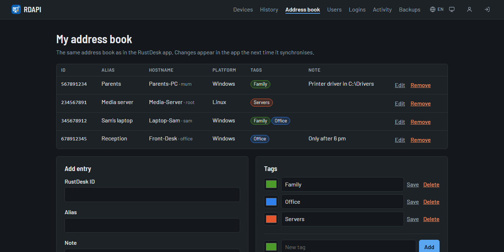

<p align="center"></p>

# RDAPI

[English](README.md) · **Deutsch**

<p align="center">
  
  <a href="https://github.com/Schnuecks/rdapi/pkgs/container/rdapi"></a>
  
  
  <a href="LICENSE"></a>
  
  
</p>

RDAPI ist ein kleiner, selbstgehosteter API-Server für die RustDesk-App. Er
ergänzt deinen eigenen ID- und Relay-Server um das, was ein Haushalt oder ein kleines Team
braucht: Anmeldung in der App, ein persönliches Adressbuch, das dir auf jedes Gerät folgt,
eine Liste deiner Geräte und einen Verlauf der eingehenden Verbindungen, dazu eine
Weboberfläche, um alles zu verwalten.

> [!IMPORTANT]
> **Öffentliche Beta.** In RDAPI funktioniert alles, aber der offizielle RustDesk-ID-Server
> (hbbs, bis 1.1.16) kann eine **angemeldete** App noch nicht verbinden: Verbindungen
> scheitern mit „Failed to secure tcp: deadline has elapsed“. Das passiert mit jedem
> API-Server und ist in RustDesks [Pull Request #706](https://github.com/rustdesk/rustdesk-server/pull/706) behoben. Bis ein Release des
> ID-Servers die Korrektur enthält, funktionieren Anmeldung, Adressbuch, Geräte und Verlauf,
> zum Verbinden meldest du dich in der App aber vorher ab. Version 1.0 folgt, sobald die
> Korrektur veröffentlicht ist.



## Funktionen

- **Anmeldung in der App** mit Benutzername und Passwort, mehrere Benutzer, Admins und
  normale Benutzer
- **Adressbuch** je Benutzer mit Tags, abgeglichen zwischen allen Geräten, auf denen du
  angemeldet bist, und auch in der Weboberfläche bearbeitbar
- **Geräteliste** mit Online-Status, Betriebssystem und Version; die App zeigt deine Geräte
  unter „Zugängliche Geräte“
- **Verbindungsverlauf:** wer sich wann und wie lange mit welchem Gerät verbunden hat
- **Weboberfläche** für Geräte, Verlauf, Adressbuch, Benutzer, Anmeldungen und dein Konto,
  in sechs Sprachen (Deutsch, Englisch, Französisch, Spanisch, Italienisch, Niederländisch),
  hell und dunkel
- **Zwei-Faktor-Anmeldung** mit einer Authenticator-App, in der Weboberfläche und in der
  RustDesk-App, mit Wiederherstellungscodes
- **Passkeys und Sicherheitsschlüssel** (FIDO2) in der Weboberfläche: Anmelden ohne
  Passwort oder als zweiter Faktor
- **Anmeldung über einen Anbieter** wie Authelia (OpenID Connect), in der Weboberfläche
  und in der App; die normale Anmeldung bleibt
- **Sicherheit:** Passwörter mit Argon2id, Tokens nur als Hash gespeichert, Fehlversuche je
  Adresse und je Benutzer begrenzt, Geräte an ihre eigene Kennung gebunden,
  Anmeldeprotokoll, Container läuft schreibgeschützt ohne Root
- **Tägliche automatische Sicherung**, Herunterladen und Zurückspielen in der Weboberfläche
- **Klein und einfach zu betreiben:** ein Container, eine SQLite-Datei, Images für amd64
  und arm64

| Verbindungsverlauf | Adressbuch |
|---|---|
|  |  |

## Schnellstart

Du brauchst Docker mit Docker Compose 2.24 oder neuer und deinen eigenen RustDesk-ID- und
Relay-Server.

```bash
mkdir rdapi && cd rdapi
curl -O https://raw.githubusercontent.com/schnuecks/rdapi/main/compose.yaml
mkdir data && chown 1000:1000 data
docker compose up -d
```

Öffne `http://<server>:21114` und lege das Admin-Konto an; den Einrichtungscode findest
du im Log (`docker compose logs rdapi`). Trag die Adresse dann in der App unter
*Einstellungen → Netzwerk* als API-Server ein. Aktualisieren:
`docker compose pull && docker compose up -d`.

Für den Zugriff aus dem Internet gehört der Server hinter einen Reverse Proxy mit HTTPS;
siehe [Installation](docs/de/installation.md).

## Dokumentation

- [Installation](docs/de/installation.md): Schnellstart, Reverse Proxy, Aktualisieren,
  Daten und Sicherung, Umzug von einem anderen API-Server
- [Konfiguration](docs/de/configuration.md): alle Einstellungen, Anmeldung über einen
  Anbieter, Benutzerkonten, Kommandozeile
- [Bedienung](docs/de/usage.md): App einrichten, Weboberfläche, Zwei-Faktor-Anmeldung,
  Passkeys, Sicherungen, Fehlersuche
- [Entwicklung](docs/de/development.md): lokal starten, Tests, API-Endpunkte,
  Übersetzungen, Releases

Was sich in jeder Version geändert hat, steht im [CHANGELOG](CHANGELOG.md) (englisch).

## Unterstützen

RDAPI ist kostenlos und bleibt es. Wenn es dir Zeit spart, kannst du mir einen
Kaffee ausgeben; das hält das Projekt am Laufen. Danke!

<p>
  <a href="https://buymeacoffee.com/il6hhwtzr6"></a>
  <a href="https://buymeacoffee.com/il6hhwtzr6"></a>
  <a href="https://buymeacoffee.com/il6hhwtzr6"></a>
</p>

## Feedback

Fehlermeldungen und Ideen gern als
[GitHub-Issue](https://github.com/schnuecks/rdapi/issues). Sicherheitsprobleme bitte
vertraulich melden; siehe [SECURITY](SECURITY.md) und [CONTRIBUTING](CONTRIBUTING.md)
(englisch).

## Lizenz

Copyright (C) 2026 Schnuecks

RDAPI ist freie Software unter der
[GNU Affero General Public License, Version 3 oder neuer](LICENSE) (AGPL-3.0-or-later). Du
darfst es nutzen, verändern und weitergeben.

Wenn du eine veränderte Version weitergibst oder anderen über ein Netzwerk anbietest, musst
du ihnen den Quellcode deiner Version unter derselben Lizenz zugänglich machen. Für diese
Version erledigt das der Link „Quellcode auf GitHub“ in der Fußzeile; bei einer eigenen
Version lässt du ihn auf deinen Quellcode zeigen (`APP_REPO` in `rdapi/web.py`).

Das Programm wird ohne jede Gewährleistung bereitgestellt; Einzelheiten stehen in der
[Lizenz](LICENSE). Die Barlow-Schriften in `rdapi/static/fonts/` stehen unter der SIL Open Font License
(siehe `OFL.txt` dort); RDAPI liefert sie selbst aus, keine Seite lädt etwas von
Google oder anderen Servern. RustDesk ist eine Marke der jeweiligen Inhaber; dieses
Projekt steht in keiner Verbindung dazu.
